# Datenmodell (ER-Übersicht)

> Automatisch aus `backend/prisma/schema.prisma` erzeugt (Stand 2026-09-29).
> Dieses Dokument existierte bisher nicht, wurde aber in `AGENTS.md §1` referenziert.
> Bei Schema-Änderungen neu erzeugen, nicht von Hand pflegen.

## 1. Überblick


| Kennzahl | Wert |
|---|---|
| Modelle | 27 |
| davon mandanten-scoped (mit `mandantId`) | 9 |
| mit UUID-Primärschlüssel | 27 |

## 2. Mandantentrennung

Diese Modelle führen ein `mandantId` und sind damit mandanten-scoped. Jede Query
auf sie muss durch den `MandantGuard` bzw. einen `mandantId`-Filter laufen
(siehe [`rollen-rbac.md`](./rollen-rbac.md)):


| Model | Tabelle |
|---|---|
| `Anhang` | `anhang` |
| `AuditLog` | `audit_log` |
| `BanzSubmission` | `banz_submission` |
| `Bilanz` | `bilanz` |
| `GuV` | `guv` |
| `Jahresabschluss` | `jahresabschluss` |
| `KonsolidierungsBuchung` | `konsolidierungs_buchung` |
| `UserMandantRole` | `user_mandant_role` |
| `WormObject` | `worm_object` |

Nicht mandanten-scoped (Kanzlei- bzw. systemweit):


| Model | Tabelle |
|---|---|
| `APIKey` | `api_key` |
| `APIKeyUsage` | `api_key_usage` |
| `AnhangAbschnitt` | `anhang_abschnitt` |
| `BilanzPosition` | `bilanz_position` |
| `BilanzPruefungsResult` | `bilanz_pruefungs_result` |
| `GuVPosition` | `guv_position` |
| `Kanzlei` | `kanzlei` |
| `KonsolidierungsEinheit` | `konsolidierungs_einheit` |
| `Mandant` | `mandant` |
| `PruefungsRegel` | `pruefungs_regel` |
| `Signature` | `signature` |
| `SystemConfig` | `system_config` |
| `User` | `user` |
| `UserSession` | `user_session` |
| `WPNotiz` | `wp_notiz` |
| `WPPruefungsAbschluss` | `wp_pruefungs_abschluss` |
| `WebhookDelivery` | `webhook_delivery` |
| `WebhookSubscription` | `webhook_subscription` |

## 3. Beziehungen

```mermaid
erDiagram

    api_key {
        string id PK
    }
    api_key_usage {
        string id PK
    }
    anhang {
        string id PK
    }
    anhang_abschnitt {
        string id PK
    }
    audit_log {
        string id PK
    }
    banz_submission {
        string id PK
    }
    bilanz {
        string id PK
    }
    bilanz_position {
        string id PK
    }
    bilanz_pruefungs_result {
        string id PK
    }
    guv {
        string id PK
    }
    guv_position {
        string id PK
    }
    jahresabschluss {
        string id PK
    }
    kanzlei {
        string id PK
    }
    konsolidierungs_buchung {
        string id PK
    }
    konsolidierungs_einheit {
        string id PK
    }
    mandant {
        string id PK
    }
    pruefungs_regel {
        string id PK
    }
    signature {
        string id PK
    }
    system_config {
        string id PK
    }
    user {
        string id PK
    }
    user_mandant_role {
        string id PK
    }
    user_session {
        string id PK
    }
    wp_notiz {
        string id PK
    }
    wp_pruefungs_abschluss {
        string id PK
    }
    webhook_delivery {
        string id PK
    }
    webhook_subscription {
        string id PK
    }
    worm_object {
        string id PK
    }
    api_key ||--o{ kanzlei : "kanzlei"
    api_key_usage ||--o{ api_key : "apiKey"
    anhang_abschnitt ||--o{ anhang : "anhang"
    banz_submission ||--o{ jahresabschluss : "jahresabschluss"
    bilanz_position ||--o{ bilanz : "bilanz"
    bilanz_pruefungs_result ||--o{ bilanz : "bilanz"
    guv_position ||--o{ guv : "guv"
    jahresabschluss ||--o{ bilanz : "bilanz"
    jahresabschluss ||--o{ guv : "guv"
    jahresabschluss ||--o{ anhang : "anhang"
    konsolidierungs_buchung ||--o{ konsolidierungs_einheit : "einheit"
    konsolidierungs_einheit ||--o{ kanzlei : "kanzlei"
    konsolidierungs_einheit ||--o{ mandant : "mutter"
    mandant ||--o{ kanzlei : "kanzlei"
    signature ||--o{ jahresabschluss : "jahresabschluss"
    user_mandant_role ||--o{ user : "user"
    user_session ||--o{ user : "user"
    wp_notiz ||--o{ user : "wpUser"
    wp_pruefungs_abschluss ||--o{ bilanz : "bilanz"
    wp_pruefungs_abschluss ||--o{ user : "wpUser"
    webhook_delivery ||--o{ webhook_subscription : "subscription"
    webhook_subscription ||--o{ kanzlei : "kanzlei"
```



## 4. Kernstruktur des Jahresabschlusses

```
Mandant 1 ──── n UserMandantRole n ──── 1 User
   │
   ├── 1:n Bilanz   ──── 1:n BilanzPosition
   ├── 1:n GuV      ──── 1:n GuVPosition
   ├── 1:n Anhang   ──── 1:n AnhangAbschnitt
   ├── 1:n Jahresabschluss
   ├── 1:n BanzSubmission
   ├── 1:n WormObject          (GoBD-Archiv, Object Lock)
   ├── 1:n AuditLog            (Hash-Chain)
   ├── 1:n KonsolidierungsEinheit ──── 1:n KonsolidierungsBuchung
   ├── 1:n BilanzPruefungsResult   (WP/IDW)
   └── 1:n UserMandantRole
```

## 5. Migrationen

| Migration | Inhalt |
|---|---|
| `2026_09_14_120000_init_baseline` | vollständiges Schema: 27 Tabellen, 84 Indizes |
| `2026_09_25_m4_production_schema` | Subscription-Felder an `kanzlei`, Hash-Chain an `audit_log` |

> Die Baseline-Migration wurde am 2026-09-28 **nachträglich** ergänzt: Das Repository
> enthielt vorher nur die M4-Migration, die ausschließlich `ALTER TABLE` auf
> `kanzlei`/`audit_log` ausführte — diese Tabellen wurden nirgends erzeugt.
> Details: `../REPARATUR-REPORT.md`.

